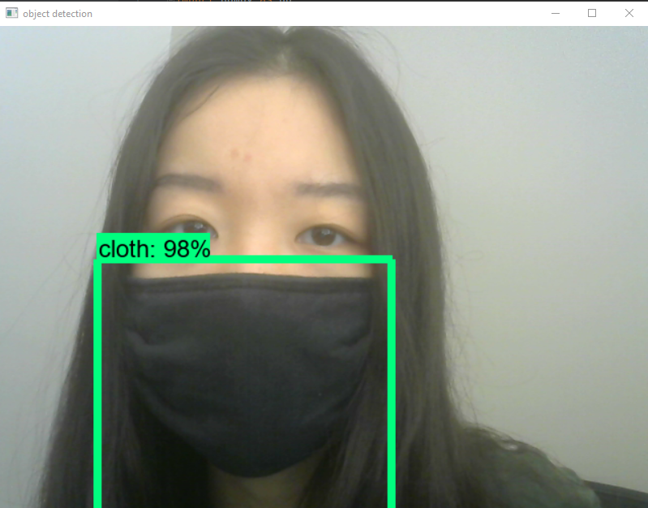

# Mask Type Classification - Primary model
## Introduction
This real-time mask-type classification model aims to help improve compliance in different settings where different types of masks are required. In addition, it can be used to support disease transmission study by examining whether the degrees of transmission in a public setting is linked to the different types of masks present.

## Data Collection
The current dataset includes 3 classes: cloth, surgical, and N95. Images are collected from the internet, and bounding boxes are drawn around each mask manually using [LabelImg](https://github.com/tzutalin/labelImg). A total of 480 images are used with 400 for training and 80 for testing.

## Model Selection and Training
This model uses transfer learning techniques by taking a pretrained model [ssd_mobilenet_v2](https://arxiv.org/abs/1512.02325) and fine-tuning its parameters to fit the new task. A total of 14k steps are run on Colab, and the metrics are tracked using Tensorboard.

## Results and Reflection
The model is tested with a webcam and shows reasonable accuracy when differenciating the different mask types. More data will be collected to improve the accuracy and generalizability.

The Colab Notebook, images, and Python scripts used in this model can be found in the following google drive folder: https://drive.google.com/drive/folders/1CqRUFq5GW--6YsqpW3gWHFq3hnTXeLg9?usp=sharing

